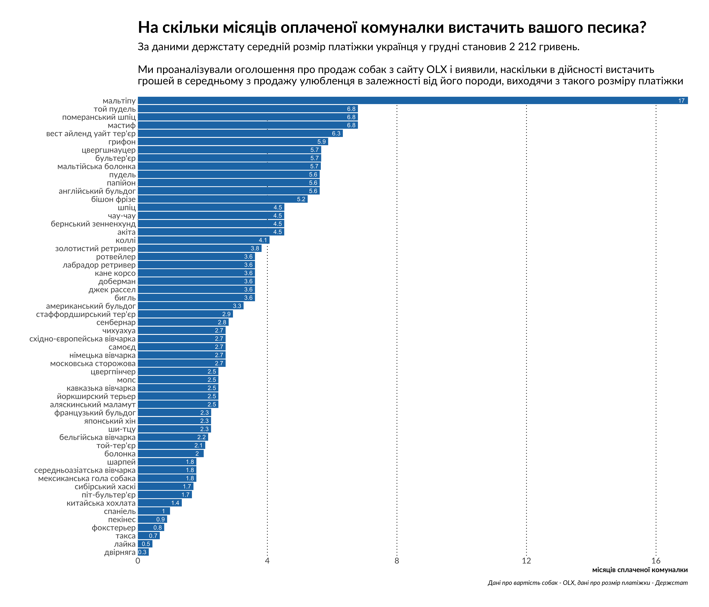
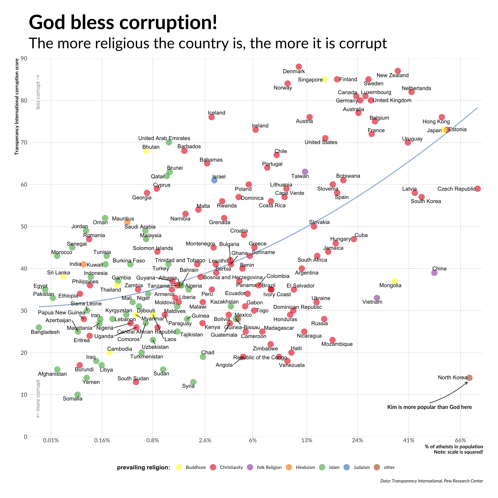

# library

This repo contains R-code and data to create graphics that I posted in [my telegram channel](https://t.me/no_shit_graphics) 

- 🗄[data](data) - folder with datafiles
- 📊[images](images) - folder with plots 
- 🔥[australia_bushfires_emojis.R](australia_bushfires_emojis.R) - analysis of most used emojis in tweets about Australian bushfires
- 🙏[places_of_worship.R](places_of_worship.R) -  the map of places of worship in Europe 

- 🐶[comunalka_dogs.R](comunalka_dogs.R) - how many dogs you need to 

- 😇[corruption_and_atheism.R](corruption_and_atheism.R)

- 🌏[world_tours.R](world_tours.R)
